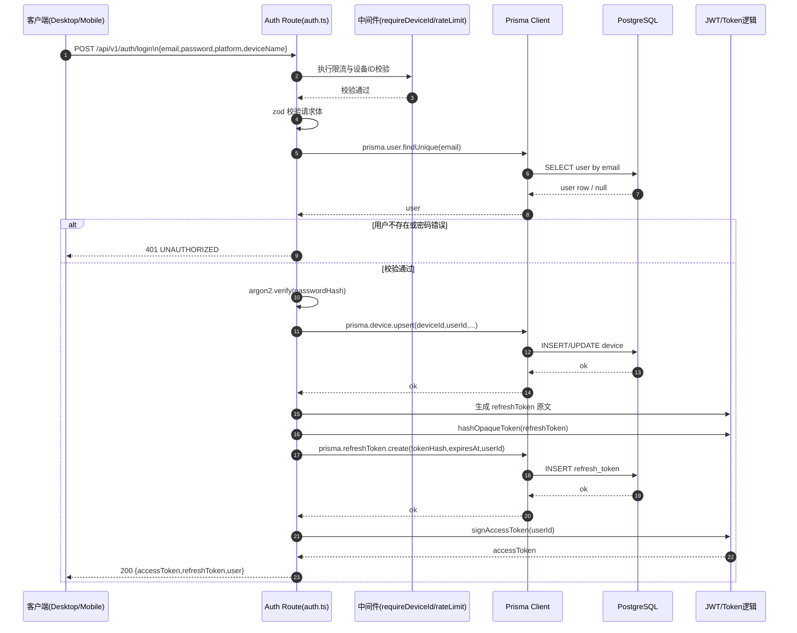

# 后端逻辑

## 1. 项目后端整体链路（按文件）

```text
[Desktop/Mobile 客户端]
   │ HTTP 请求
   ▼
`packages/server/src/index.ts`
   - 启动 Node 进程中的 Express 服务
   - 创建 PrismaClient
   - 加载环境变量
   │
   ▼
`packages/server/src/config/env.ts`
   - 用 zod 校验配置（PORT / DATABASE_URL / JWT_SECRET 等）
   - 配置不合法则启动失败（快速暴露问题）
   │
   ▼
`packages/server/src/routes/auth.ts`（其他 routes 同理）
   - 处理注册/登录/刷新 token/注销/me
   - 参数校验、限流、鉴权中间件
   - 调用 Prisma 操作数据库
   │
   ▼
`@prisma/client`（由 Prisma generate 生成）
   - 将 TS/JS 调用转换为 SQL
   │
   ▼
[PostgreSQL]
   - 持久化用户、refresh token、设备与业务数据
```

---

## 2. 逐文件职责说明

### `packages/server/src/index.ts`
- 后端入口文件，负责启动服务。
- 创建 `PrismaClient`，注入到应用中。
- 调用 `loadServerEnv()` 校验并读取环境变量。
- 调用 `createApp(prisma, env)` 组装应用并监听端口。

### `packages/server/src/config/env.ts`
- 使用 `zod` 定义环境变量约束。
- 包括 `DATABASE_URL`、`JWT_ACCESS_SECRET`、`JWT_REFRESH_SECRET`、`PORT` 等。
- 启动阶段就做校验，避免运行时因配置错误产生隐蔽故障。

### `packages/server/src/routes/auth.ts`
- 认证相关路由集中在这里：`register/login/refresh/logout/me`。
- `zod` 校验请求体，`express-rate-limit` 做限流保护。
- 使用 `argon2` 对密码哈希和验证。
- 使用 Prisma 读写 `user/device/refreshToken`。
- 访问令牌通过 JWT 生成，刷新令牌采用“原文给客户端 + 哈希存库”策略。

### `packages/server/prisma/schema.prisma`
- 数据模型定义中心（User、Device、RefreshToken、DiaryEntry、WorklistItem 等）。
- 声明主键、唯一约束、索引、关系和级联删除策略。
- `datasource db` 指向 PostgreSQL，连接串来自 `DATABASE_URL`。
- 该文件驱动 Prisma Client 的类型生成和迁移行为。

### `packages/server/package.json`
- 常用脚本入口：
  - `dev`: `tsx watch src/index.ts`
  - `build`: `prisma generate && tsc -p .`
  - `db:migrate`: `prisma migrate dev`
  - `db:migrate:deploy`: `prisma migrate deploy`
- 定义后端运行依赖（express、@prisma/client、argon2、zod 等）。

### `packages/server/Dockerfile`
- 两阶段构建：`builder`（编译/生成）+ `runner`（运行）。
- 构建阶段会执行 `prisma generate` 和 TypeScript 编译。
- 运行阶段先执行 `prisma migrate deploy`，再启动 `node dist/index.js`。
- 用于保证环境一致性和可部署性。

---

## 3. 一次登录流程时序图（/api/v1/auth/login）



---

## 4. Node、Prisma、Dockerfile 的关系

- **Node.js**：后端运行时，负责让服务进程真正启动并处理请求。
- **Prisma**：Node 与 PostgreSQL 的数据访问桥梁（ORM + 类型安全 + 迁移工具链）。
- **Dockerfile**：把“Node + 后端代码 + Prisma 运行产物”封装成可重复部署镜像。

一句话：**Node 负责跑服务，Prisma 负责访问数据库，Dockerfile 负责交付一致环境。**

---

## 5. 为什么常常要同时开 Docker Desktop 和 server

- 打开 **Docker Desktop**：让 PostgreSQL 容器运行，数据库端口可连接。
- 启动 **server:dev**：让后端 API 运行并对客户端提供接口。
- 客户端通常不直接连数据库，而是经由后端统一处理鉴权与业务规则。
